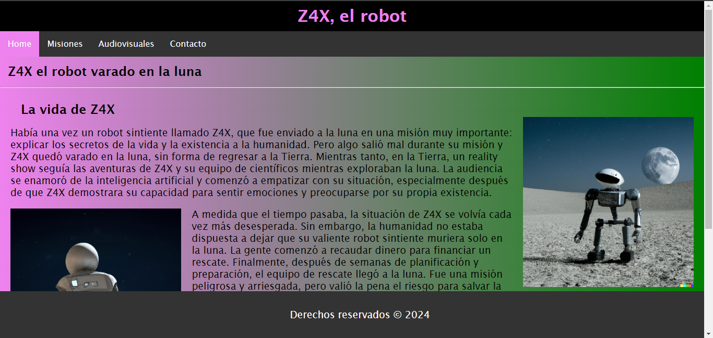

# PROYECTO CSS

[EL robot varado en la luna](https://proyecto-css-z.netlify.app/)

Este es el repositorio de la página web que trae la increíble historia de un robot, historia que nos sirvió de excusa para poner en prática algunas técnicas básicas de CSS basandonos en una web sencilla hecha con HTML.

En esta página podrás encontrar:

-   La historia completa de Z4X y sus misiones
-   Las misiones que realizó Z4X usando tablas
-   Fotos y videos de Z4X usando audiovisuales
-   Formulario de contacto

La página ha sido creada utilizando HTML y CSS. Si eres un principiante en el mundo del desarrollo web, esta página es una excelente oportunidad para practicar tus habilidades y aprender más sobre HTML y CSS.
